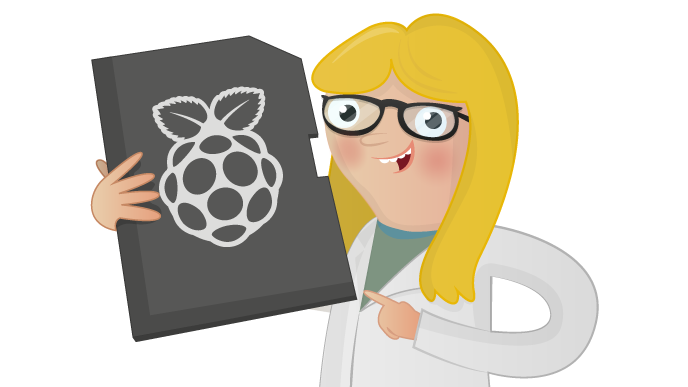

# Installing Raspbian with NOOBS

So you've just got hold of your first Raspberry Pi and you need to get it up and running, or maybe your old SD card just isn't cutting it anymore and you want a fresh install, or perhaps there's a new version of Raspbian that you're desperate to try out. This resource will show you how to get up and running with Raspbian on your Raspberry Pi, in no time at all.

## Licence

Unless otherwise specified, everything in this repository is covered by the following licence:

***Installing Raspbian with NOOBS*** by the [Raspberry Pi Foundation](http://www.raspberrypi.org) is licenced under a [Creative Commons Attribution 4.0 International License](http://creativecommons.org/licenses/by-sa/4.0/).

Based on a work at https://github.com/raspberrypilearning/noobs-install
