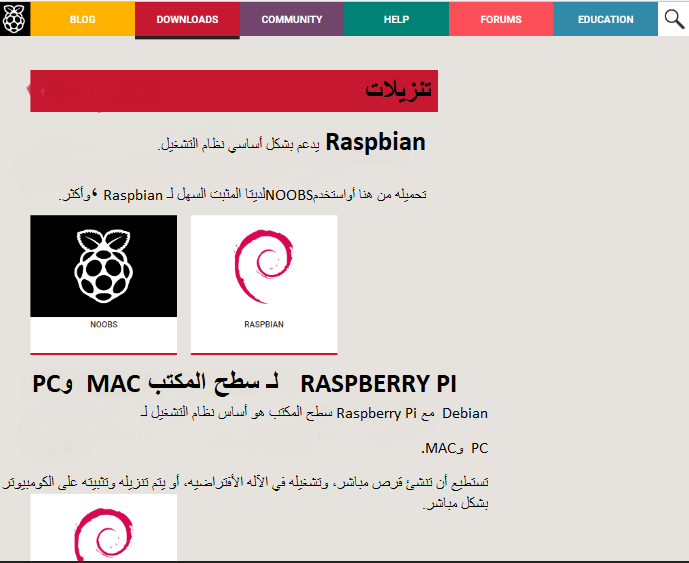
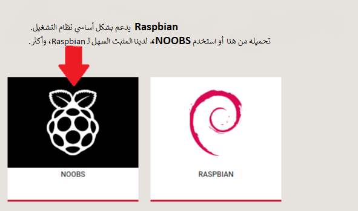
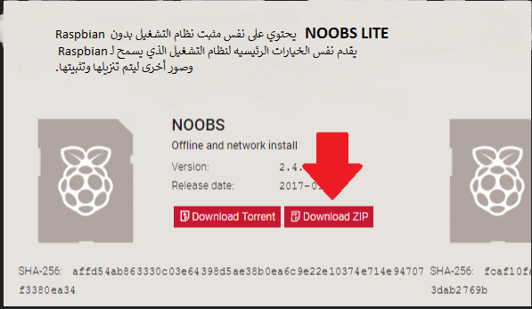
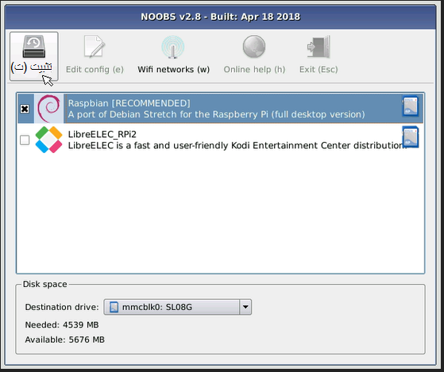
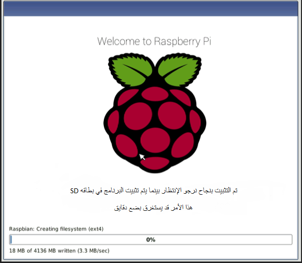
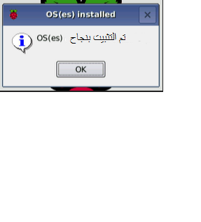

### تنزيل NOOBS

استخدام NOOBS هو أسهل طريقة لتثبيت Raspbian على بطاقة SD الخاصة بك. للحصول على نسخة من NOOBS:

+ تفضل بزيارة [www.raspberrypi.org/downloads/](https://www.raspberrypi.org/downloads/)

+ سترى مربعًا يحتوي على رابط لملفات NOOBS. اضغط على الرابط.

+ الخيار الأبسط هو تنزيل أرشيف الملفات بتنسيق zip.

### تنسيق بطاقة SD

إذا كانت بطاقة SD التي ترغب في تثبيت برنامج Raspbian عليها حاليًا تحتوي على إصدار قديم من Raspbian ، فقد ترغب في نسخ الملفات احتياطيًا من البطاقة أولاً ، حيث ستتم الكتابة فوقها أثناء هذه العملية.

+ قم بزيارة موقع ويب SD Association وقم بتنزيل [SD Formatter 4.0](https://www.sdcard.org/downloads/formatter_4/index.html) لنظام Windows أو Mac.

+ اتبع التعليمات لتثبيت البرنامج.

+ أدخل بطاقة SD في جهاز الكمبيوتر أو قارئ بطاقة SD الخاص بالكمبيوتر المحمول وقم بتدوين حرف محرك الأقراص المخصص له ، على سبيل المثال `F: /`.

+ في SD Formatter ، حدد حرف محرك الأقراص لبطاقة SD الخاصة بك ، وقم بتهيئته.

### استخراج NOOBS من الأرشيف المضغوط

بعد ذلك ، ستحتاج إلى استخراج الملفات من أرشيف NOOBS المضغوط الذي قمت بتنزيله من موقع Raspberry Pi على الويب.

+ انتقل إلى المجلد *Downloads* واعثر على ملف zip الذي قمت بتنزيله.

+ قم باستخراج الملفات والاحتفاظ بالنافذة الناتجة عن Explorer / Finder مفتوحة.

### نسخ الملفات

+ الآن افتح نافذة مستكشف / مستكشف أخرى وانتقل إلى بطاقة SD. من الأفضل وضع النافذة جنبًا إلى جنب.

+ حدد جميع الملفات من مجلد *NOOBS* واسحبها إلى بطاقة SD.

+ أخرج بطاقة SD.

### تمهيد من NOOBS

+ بمجرد نسخ الملفات ، أدخل بطاقة SD الصغيرة في جهاز Raspberry Pi ، وقم بتوصيل Pi في مصدر طاقة.

+ سيتم عرض اختيارك عند تحميل المثبت. يجب عليك تحديد المربع الخاص بـ **Raspbian**، ثم انقر فوق **Install**.

+ انقر فوق **نعم** في مربع حوار التحذير ، ثم استرح وأسترخي. سيستغرق الأمر بعض الوقت ، ولكن Raspbian سوف يثبت.

+ عند تثبيت Raspbian ، انقر فوق **OK** وستتم إعادة تشغيل Raspberry Pi وسيقوم Raspbian بتشغيل الحذاء.

