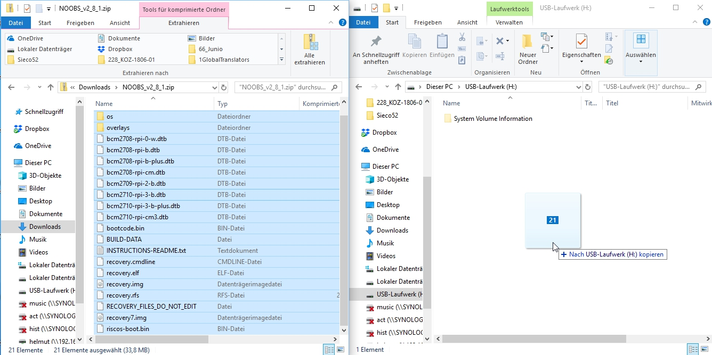

### Herunterladen von NOOBS

Die Verwendung von NOOBS ist der einfachste Weg, um Raspbian auf deiner SD-Karte zu installieren. So bekommst du eine Kopie von NOOBS:

+ Besuche [www.raspberrypi.org/downloads/](https://www.raspberrypi.org/downloads/)

+ Du solltest einen Kasten mit einem Link zu den NOOBS-Dateien sehen. Klicke auf den Link.

+ Am einfachsten ist es, das Zip-Archiv der Dateien herunterzuladen.

### Formatieren der SD-Karte

Wenn auf der SD-Karte, auf der du Raspbian installieren möchtest, derzeit eine ältere Version von Raspbian installiert ist, solltest du möglicherweise zuerst die Dateien von der Karte sichern, da sie während dieses Vorgangs überschrieben werden.

+ Besuche die Website der SD Association und lade den [SD Formatter 4.0](https://www.sdcard.org/downloads/formatter_4/index.html) für Windows oder Mac herunter.

+ Folge den Anweisungen, um die Software zu installieren.

+ Stecke deine SD-Karte in den SD-Kartenleser des Computers oder Laptops ein und notiere dir den Laufwerksbuchstaben, z. B. `F: /`.

+ Wähle im SD Formatter den Laufwerksbuchstaben für deine SD-Karte und formatiere sie.

### Extrahieren von NOOBS aus dem Zip-Archiv

Als nächstes musst du die Dateien aus dem NOOBS-ZIP-Archiv extrahieren, das du von der Raspberry Pi-Website heruntergeladen hast.

+ Gehe zu deinem Ordner "*Downloads*" und suche die heruntergeladene ZIP-Datei.

+ Extrahiere die Dateien und halte das resultierende Explorer / Finder-Fenster geöffnet.

### Kopieren der Dateien

+ Öffne nun ein anderes Explorer / Finder-Fenster und navigiere zur SD-Karte. Am besten positionierst du die beiden Fenster nebeneinander.

+ Markiere alle Dateien aus dem Ordner *NOOBS* und ziehe sie auf die SD-Karte.

+ Wirf die SD-Karte aus.

### Booten von NOOBS

+ Wenn die Dateien fertig kopiert wurden, lege die microSD-Karte in deinen Raspberry Pi ein und stecke den Pi an eine Stromquelle.

+ Dir wird eine Auswahl angeboten, wenn das Installationsprogramm geladen wurde. Du solltest das Kontrollkästchen für **Raspbian** aktivieren und dann auf **Installieren** klicken.

+ Klicke im Warndialog auf **Ja**, lehne dich zurück und entspanne dich. Es wird eine Weile dauern, aber Raspbian wird installiert.

+ Nachdem Raspbian installiert wurde, klicke auf **OK** und dein Raspberry Pi wird neu starten und Raspbian wird hochfahren.

