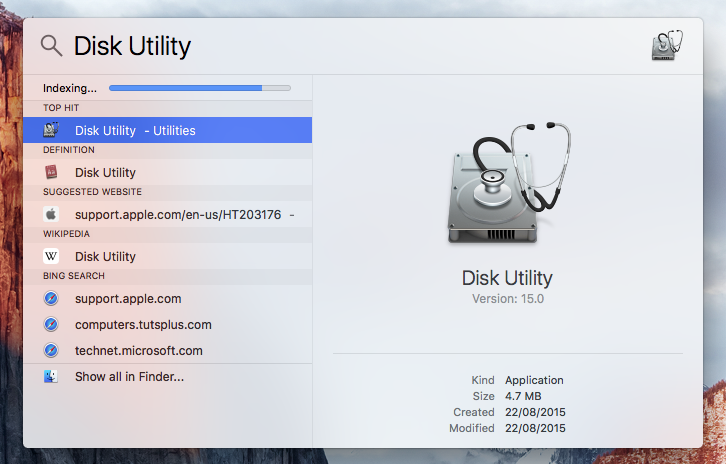
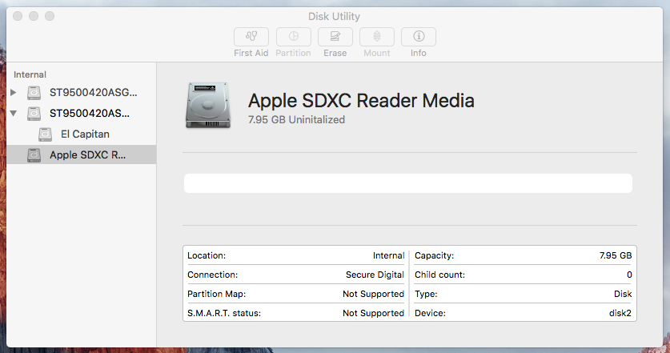
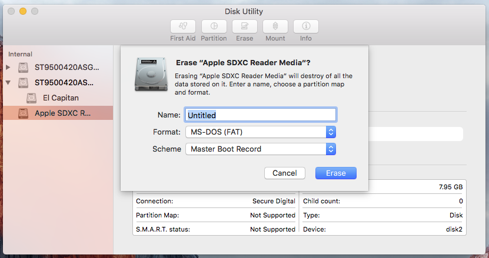
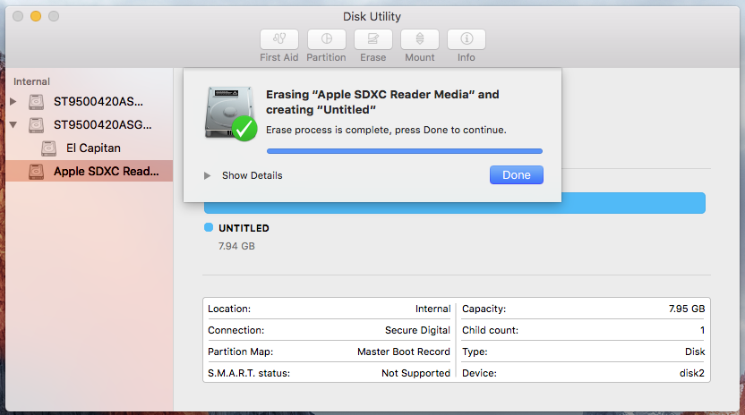
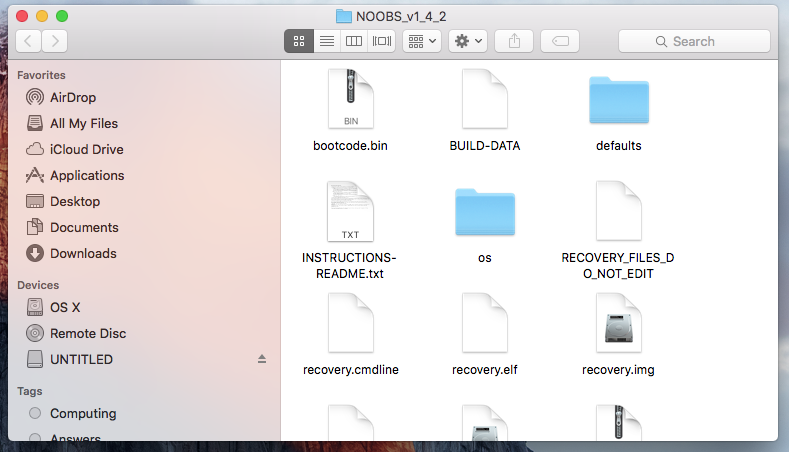
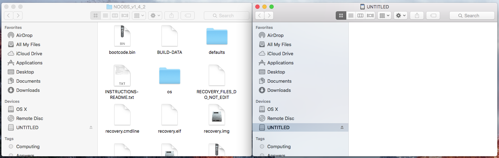
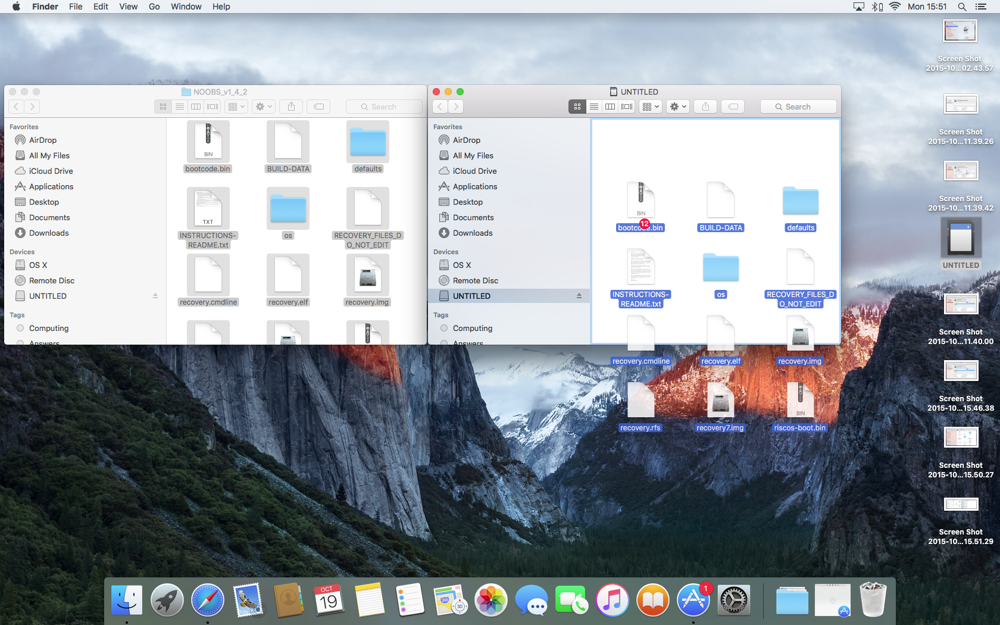

# Installing Raspbian using Apple OS X El Capitan

## Preparing the SD Card

If you have a fresh SD Card then the following steps may not be necessary, but they won't do any harm if you are unsure.

1. Start *Spotlight* by either clicking on the magnifying glass in the top right hand corner of the screen or by tapping the *Command Key* and *Space* on your keyboard.

2. Type *Disk Utility* into the search bar.

3. Choose the *Disk Utility* program which should be the the top hit.

4. In the *Disk Utility* program, the available disks should be listed in the left-hand panel. Select it, and check that the *Capacity* matches the SD card that you inserted.

5. Click the *Erase* button in the menu bar.

6. Change the *Format* to **MS-DOS (FAT)** and click on *Erase*.

7. When the format has completed click on *Done*

## Copying over the files.

1. OS X automatically extracts downloaded zip files, so in your Downloads folder you should see a folder titled *NOOBS* with some version numbers after it.

2. Open up a new *Finder* window and navigate to the SD Card. It is best to position the two windows side by side.

3. Select all the files in the *NOOBS* folder and drag them into the SD Card window.

4. Eject the SD card.

4. That's it. You're finished. Click on the link below the image to learn how to install Raspbian Jesse on your Raspberry Pi.
