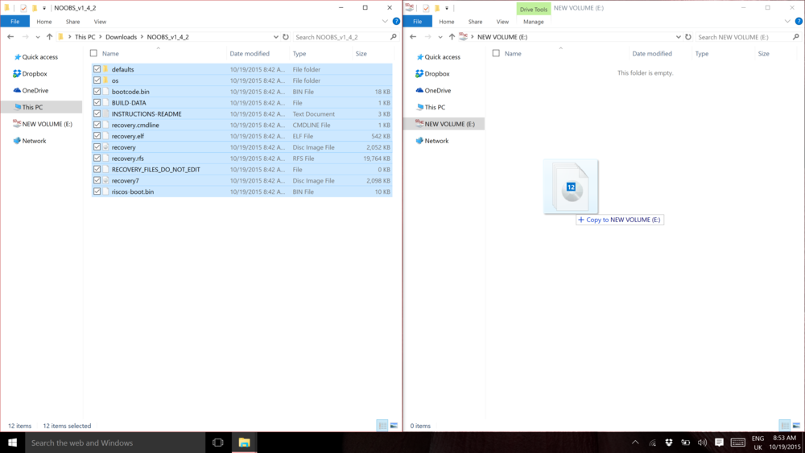

### Downloading NOOBS

Using NOOBS is the easiest way to install Raspbian on your SD card. To get hold of a copy of NOOBS:

+ Visit [https://www.raspberrypi.org/downloads/](https://www.raspberrypi.org/downloads/)

+ You should see a box with a link to the NOOBS files. Click on the link.

+ The simplest option is to download the zip archive of the files.

### Formatting the SD Card

If the SD card you wish to install Raspbian on currently has an older version of Raspbian, you may wish to back up the files from the card first as they will be overwritten during this process.

+ Visit the SD Association’s website and download [SD Formatter 4.0](https://www.sdcard.org/downloads/formatter_4/index.html) for either Windows or Mac.

+ Follow the instructions to install the software.

+ Insert your SD card into the computer or laptop’s SD card reader and make a note of the drive letter allocated to it, e.g. `F:/`

+ In SD Formatter, select the drive letter for your SD card and format it.

### Extracting NOOBS from the zip archive

Next, you will need to extract the files from the NOOBS zip archive you downloaded from the Raspberry Pi website.

+ Go to your *Downloads* folder and find the zip file you downloaded.

+ Extract the files and keep the resulting Explorer/Finder window open.

### Copying the files

+ Now open another Explorer/Finder window and navigate to the SD card. It's best to position the two windows side by side.

+ Select all the files from the *NOOBS* folder and drag them onto the SD card

  

+ Eject the SD card

### Booting from NOOBS

+ Once the files have been copied over, insert the micro SD Card into your Raspberry Pi and then plug it into a power source.

+ You will be provided with a single option, once the installer has loaded. You should check the box for **Raspbian**, and then click **Install**.

+ Click **Yes** at the warning dialog, and then sit back and relax. It will take a while, but Raspbian will install.
