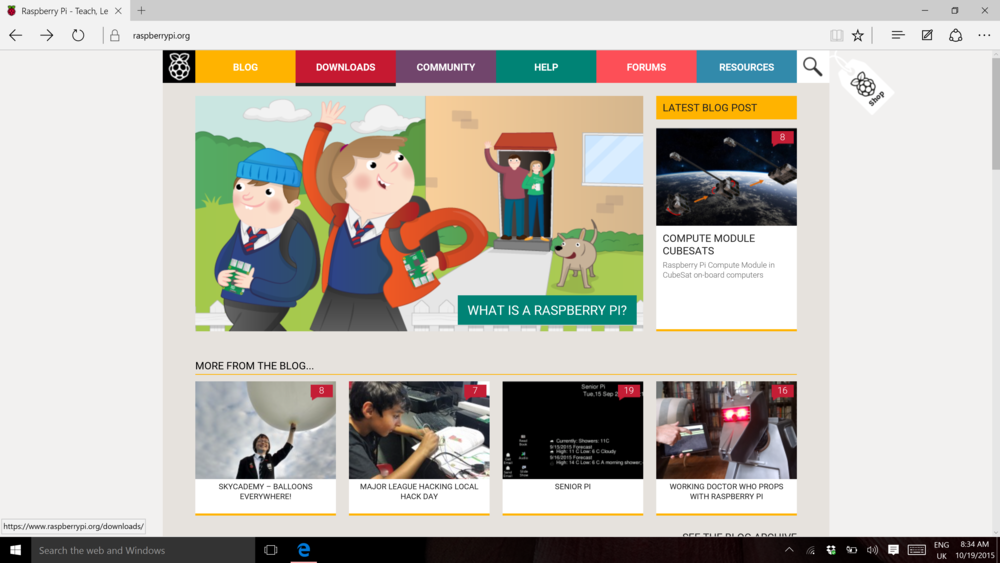
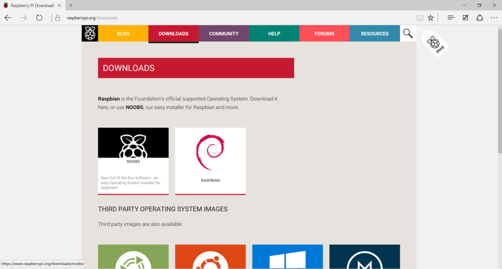
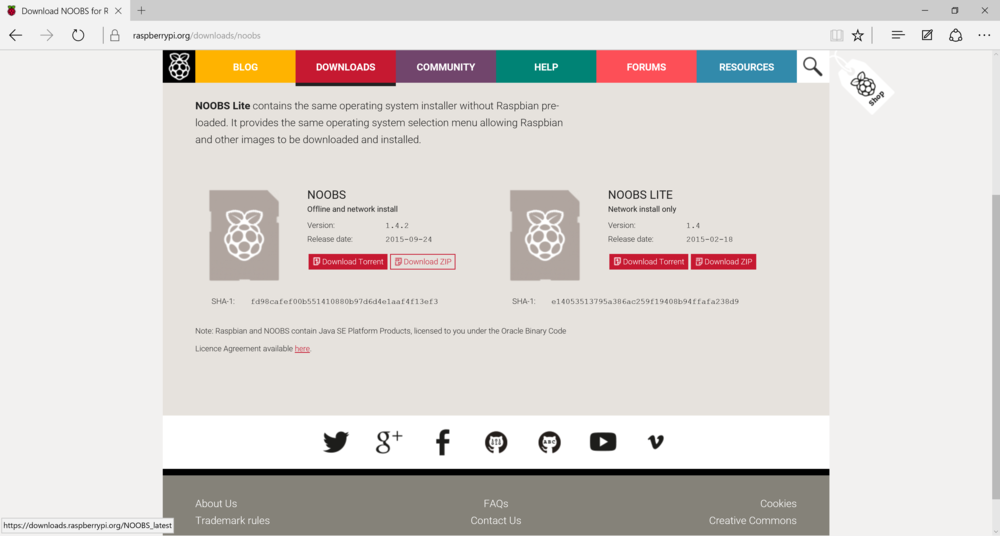

## Downloading NOOBS

Using NOOBS is the easiest way to install Raspbian on your SD card. To get hold of a copy of NOOBS:

- Visit [www.raspberrypi.org](https://www.raspberrypi.org/) and click on the DOWNLOADS button in the navigation bar, at the top of the screen.

  

2. You should see a box which contains a link to the NOOBS files. Click on the link.

  

3. If you're familiar with torrenting, then you can download the NOOBS files via a torrent client, but otherwise the simplest option is to download the zip archive of the files.

  

