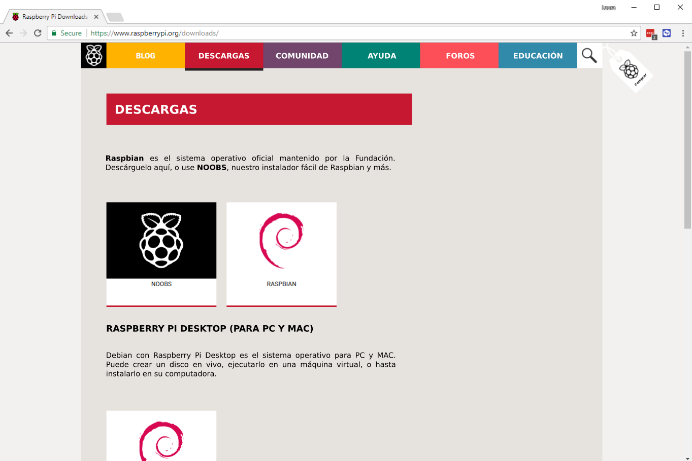
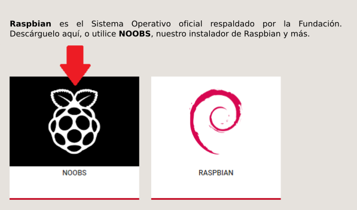
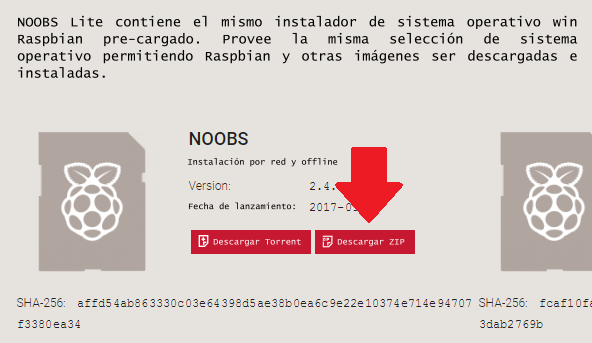
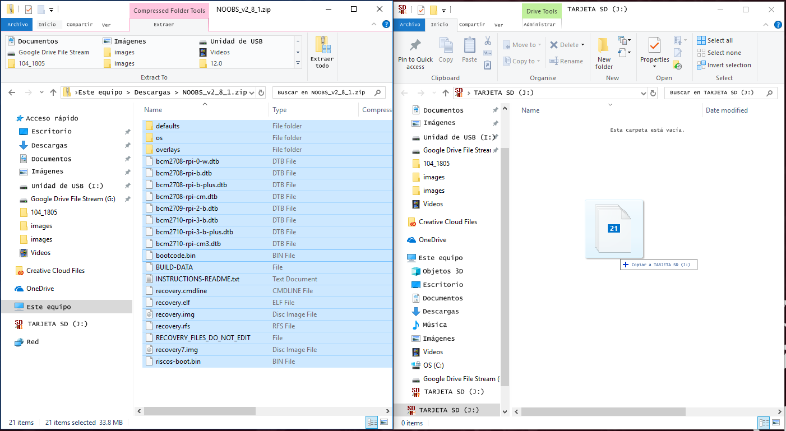
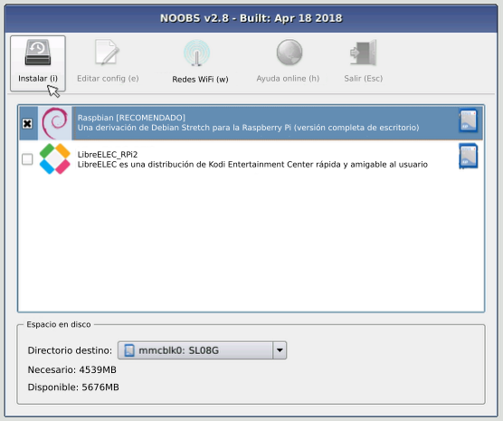
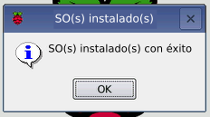

### Descargando NOOBS

Usar NOOBS es la forma más fácil de instalar Raspbian en su tarjeta SD. Para obtener una copia de NOOBS:

+ Visita [www.raspberrypi.org/downloads/](https://www.raspberrypi.org/downloads/)

+ Debería ver un cuadro con un enlace a los archivos de NOOBS. Haga clic en el enlace.

+ La opción más simple es descargar el fichero zip con los archivos.

### Formateo de la tarjeta SD

Si la tarjeta SD en la que desea instalar Raspbian actualmente tiene una versión anterior de Raspbian, es recomendable que haga una copia de seguridad de los archivos de la tarjeta, ya que se sobrescribirán durante este proceso.

+ Visite el sitio web de la Asociación SD y descargue [ SD Formatter 4.0 ](https://www.sdcard.org/downloads/formatter_4/index.html) para Windows o Mac.

+ Siga las instrucciones para instalar el software.

+ Inserte su tarjeta SD en el lector de tarjetas SD de la computadora o laptop y anote la letra de la unidad asignada, por ejemplo, ` F: / `.

+ En SD Formatter, seleccione la letra de la unidad de su tarjeta SD y formatéela.

### Extrayendo NOOBS del fichero zip

A continuación, deberá extraer los archivos del fichero zip de NOOBS que descargó del sitio web de Raspberry Pi.

+ Vaya a su carpeta de * descargas * y encuentre el fichero zip que descargó.

+ Extraiga los archivos y mantenga abierta la ventana resultante del Explorador / Finder.

### Copiando los archivos

+ Ahora abra otra ventana del Explorerador / Finder y navegue a la tarjeta SD. Es mejor colocar las dos ventanas una al lado de la otra.

+ Seleccione todos los archivos de la carpeta * NOOBS * y arrástrelos a la tarjeta SD.

+ Expulse la tarjeta SD.

### Arranque desde NOOBS

+ Una vez que los archivos han sido copiados, inserte la tarjeta micro SD en su Raspberry Pi, y conecte el Pi a una fuente de alimentación.

+ Se le ofrecerá una opción cuando el instalador se haya cargado. Debes marcar la casilla para ** Raspbian **, y luego haga clic en ** Instalar **.

+ Haga clic en ** Sí ** en el diálogo de advertencia, y luego siéntese y relájese. Llevará un tiempo, pero Raspbian se instalará.

+ Cuando se haya instalado Raspbian, haga clic en ** Aceptar ** y tu Raspberry Pi se reiniciará y Raspbian se iniciará.

