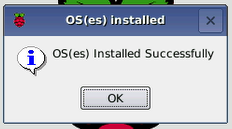

### एनओबीबीएस डाउनलोड करना

एनओबीबीएस का उपयोग करना आपके एसडी कार्ड पर रास्पियन स्थापित करने का सबसे आसान तरीका है। एनओबीबीएस की एक प्रति प्राप्त करने के लिए:

+ [www.raspberrypi.org/downloads/](https://www.raspberrypi.org/downloads/) पर जाएँ

+ आपको एनओबीबीएस फाइलों के लिंक के साथ एक बॉक्स देखना चाहिए। लिंक पर क्लिक करें।

+ फ़ाइलों का ज़िप संग्रह डाउनलोड करना सबसे आसान विकल्प है।

### एसडी कार्ड स्वरूपण

यदि एसडी कार्ड जिस पर आप रास्पबियन को स्थापित करना चाहते हैं, वर्तमान में इसमें रास्पियन का पुराना संस्करण है, तो आप पहले कार्ड से फ़ाइलों का बैक अप लेना चाहेंगे, क्योंकि इस प्रक्रिया के दौरान उन्हें ओवरराइट किया जाएगा।

+ एसडी एसोसिएशन की वेबसाइट पर जाएं और विंडोज या मैक के लिए [एसडी फॉर्मेटर 4.0](https://www.sdcard.org/downloads/formatter_4/index.html) डाउनलोड करें।

+ सॉफ्टवेयर स्थापित करने के लिए निर्देशों का पालन करें।

+ अपने एसडी कार्ड को कंप्यूटर या लैपटॉप के एसडी कार्ड रीडर में डालें और इसे आवंटित ड्राइव अक्षर का नोट बनाएं, उदाहरण के लिए `एफ: /`।

+ एसडी फॉर्मेटर में, अपने एसडी कार्ड के लिए ड्राइव अक्षर का चयन करें, और इसे प्रारूपित करें।

### ज़िप संग्रह से एनओबीबीएस निकालना

इसके बाद, आपको रास्पबेरी पीआई वेबसाइट से डाउनलोड किए गए एनओओबीएस ज़िप संग्रह से फ़ाइलों को निकालने की आवश्यकता होगी।

+ अपने *डाउनलोड* फ़ोल्डर पर जाएं और डाउनलोड की गई ज़िप फ़ाइल ढूंढें।

+ फ़ाइलों को निकालें और परिणामस्वरूप एक्सप्लोरर / फाइंडर विंडो खोलें।

### फाइलों की प्रतिलिपि बनाना

+ अब एक और एक्सप्लोरर / फाइंडर विंडो खोलें और एसडी कार्ड पर नेविगेट करें। दोनों खिड़कियों की तरफ से स्थिति रखना सबसे अच्छा है।

+ *NOOBS* फ़ोल्डर से सभी फ़ाइलों का चयन करें और उन्हें एसडी कार्ड पर खींचें।

+ एसडी कार्ड बाहर निकालें।

### एनओबीबीएस से बूटिंग

+ एक बार फाइलों की प्रतिलिपि बना लेने के बाद, अपने रास्पबेरी पीआई में माइक्रो एसडी कार्ड डालें, और पीआई को पावर स्रोत में प्लग करें।

+ इंस्टॉलर लोड होने पर आपको एक विकल्प दिया जाएगा। आपको **रास्पियन**लिए बॉक्स को चेक करना चाहिए, और उसके बाद **इंस्टॉल करें**क्लिक करें।

+ चेतावनी संवाद पर **हां** पर क्लिक करें, और फिर वापस बैठें और आराम करें। इसमें कुछ समय लगेगा, लेकिन रास्पियन स्थापित होगा।

+ जब रास्पियन स्थापित किया गया है, तो **ठीक** क्लिक करें और आपकी रास्पबेरी पाई फिर से शुरू हो जाएगी और रास्पियन तब बूट हो जाएगी।

