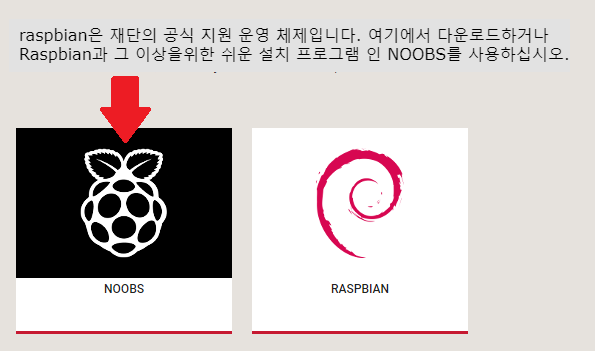
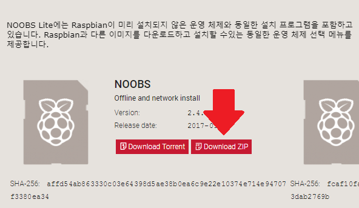

### NOOBS 다운로드

NOOBS를 사용하면 SD 카드에 Raspbian을 설치하는 가장 쉬운 방법입니다. NOOBS의 사본을 얻으려면 :

+ [방문 www.raspberrypi.org/downloads/](https://www.raspberrypi.org/downloads/)

+ NOOBS 파일에 대한 링크가있는 상자가 나타납니다. 링크를 클릭하십시오.

+ 가장 간단한 옵션은 파일의 zip 아카이브를 다운로드하는 것입니다.

### SD 카드 포맷하기

Raspbian을 설치하려는 SD 카드에 현재 Raspbian의 이전 버전이있는 경우이 과정에서 덮어 쓰게되므로 카드에서 파일을 먼저 백업 할 수 있습니다.

+ SD 협회 웹 사이트를 방문하여 Windows 또는 Mac 용 [SD Formatter 4.0](https://www.sdcard.org/downloads/formatter_4/index.html) 을 다운로드하십시오.

+ 지침에 따라 소프트웨어를 설치하십시오.

+ SD 카드를 컴퓨터 또는 랩톱의 SD 카드 판독기에 넣고 할당 된 드라이브 문자 (예 : `F : /`메모하십시오.

+ SD Formatter에서 SD 카드의 드라이브 문자를 선택하고 포맷하십시오.

### zip 아카이브에서 NOOBS 추출하기

다음으로, Raspberry Pi 웹 사이트에서 다운로드 한 NOOBS zip 아카이브에서 파일을 추출해야합니다.

+ *다운로드* 폴더로 이동하여 다운로드 한 zip 파일을 찾으십시오.

+ 파일을 추출하고 결과 탐색기 / 찾기 윈도우를 열어 두십시오.

### 파일 복사

+ 이제 다른 탐색기 / Finder 창을 열고 SD 카드로 이동하십시오. 두 개의 창을 나란히 놓는 것이 가장 좋습니다.

+ *NOOBS* 폴더에있는 모든 파일을 선택하고 SD 카드에 끌어다 놓습니다.

+ SD 카드를 꺼냅니다.

### NOOBS에서 부팅하기

+ 파일을 복사 한 후에는 Micro SD 카드를 Raspberry Pi에 넣고 Pi를 전원에 연결하십시오.

+ 설치 프로그램이로드되면 선택 항목이 제공됩니다. **Raspbian**상자를 선택하고 **Install**을 클릭해야합니다.

+ 경고 대화 상자에서 **예** 을 클릭 한 다음 편안히 앉아 휴식을 취하십시오. 시간이 좀 걸리지 만 Raspbian이 설치됩니다.

+ Raspbian이 설치되면 **클릭하고** 클릭하면 Raspberry가 다시 시작되고 Raspbian이 부팅됩니다.

