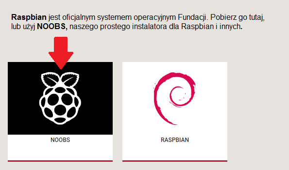
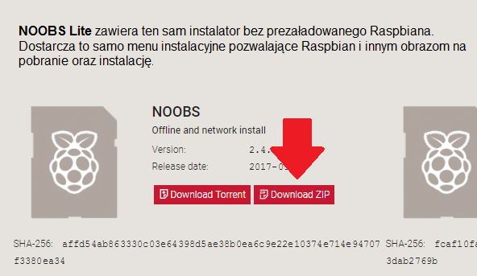

### Pobieranie NOOBS

Korzystanie z NOOBS to najprostszy sposób na zainstalowanie Raspbian na karcie SD. Aby zdobyć kopię NOOBS:

+ Odwiedź [www.raspberrypi.org/downloads/](https://www.raspberrypi.org/downloads/)

+ Powinieneś zobaczyć pole z linkiem do plików NOOBS. Kliknij w link.

+ Najprostszą opcją jest pobranie archiwum zip z plików.

### Formatowanie karty SD

Jeśli karta SD, na której chcesz zainstalować Raspbian, ma obecnie starszą wersję Raspbian, możesz najpierw wykonać kopię zapasową plików z karty, ponieważ zostaną one nadpisane podczas tego procesu.

+ Odwiedź stronę SD Association i pobierz [SD Formatter 4.0](https://www.sdcard.org/downloads/formatter_4/index.html) dla Windows lub Mac.

+ Postępuj zgodnie z instrukcjami, aby zainstalować oprogramowanie.

+ Włóż kartę SD do czytnika kart SD komputera lub laptopa i zanotuj przypisaną do niej literę dysku, np. `F: /`.

+ W SD Formatter wybierz literę dysku dla karty SD i sformatuj ją.

### Wyodrębnianie NOOBS z archiwum zip

Następnie musisz wyodrębnić pliki z archiwum zip NOOBS pobranego ze strony Raspberry Pi.

+ Przejdź do swojego folderu *Pobrane* i znajdź pobrany plik zip.

+ Wyodrębnij pliki i pozostaw otwarte okno Eksploratora / menadżera plików.

### Kopiowanie plików

+ Teraz otwórz kolejne okno Eksploratora / Menadżera plików i przejdź do karty SD. Najlepiej ustawić dwa okna obok siebie.

+ Wybierz wszystkie pliki z folderu *NOOBS* i przeciągnij je na kartę SD.

+ Odmontuj kartę SD.

### Ładowanie z NOOBS

+ Po skopiowaniu plików włóż kartę micro SD do swojego Raspberry Pi i podłącz Pi do źródła zasilania.

+ Po załadowaniu instalatora otrzymasz propozycję wyboru. Powinieneś zaznaczyć pole wyboru **Raspbian**, a następnie kliknąć **Install**.

+ Kliknij **Yes** w oknie dialogowym ostrzeżenia, a następnie usiądź wygodnie i zrelaksuj się. To zajmie trochę czasu, ale Raspbian się zainstaluje.

+ Kiedy Raspbian zostanie zainstalowany, kliknij **OK** a Raspberry Pi uruchomi się ponownie, a Raspbian uruchomi się.

