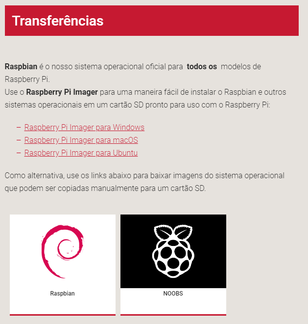
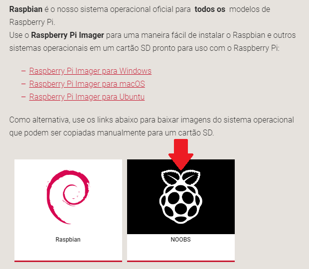

### Baixando NOOBS

Usar o NOOBS é a maneira mais fácil de instalar o Raspbian no seu cartão SD. Para obter uma cópia do NOOBS:

+ Visite [www.raspberrypi.org/downloads/](https://www.raspberrypi.org/downloads/)

+ Você deve ver uma caixa com um link para os arquivos NOOBS. Clique no link.

+ A opção mais simples é baixar o arquivo zip dos arquivos.

### Formatando o cartão SD

Se o cartão SD no qual você deseja instalar o Raspbian atualmente tiver uma versão mais antiga do Raspbian, você deve fazer o backup dos arquivos do cartão primeiro, pois eles serão sobrescritos durante este processo.

+ Visite o site da SD Association e baixe [SD Formatter 4.0](https://www.sdcard.org/downloads/formatter_4/index.html) para Windows ou Mac.

+ Siga as instruções para instalar o software.

+ Insira o cartão SD no leitor de cartão SD do computador ou laptop e anote a letra da unidade alocada a ele, por exemplo, `F: /`.

+ No SD Formatter, selecione a letra da unidade do cartão SD e formate-a.

### Extraindo NOOBS do arquivo zip

Em seguida, você precisará extrair os arquivos do arquivo zip NOOBS que você baixou do site do Raspberry Pi.

+ Vá para a pasta *Downloads* e encontre o arquivo zip que você baixou.

+ Extraia os arquivos e mantenha aberta a janela resultante do Explorer / Finder.

### Copiando os arquivos

+ Agora abra outra janela do Explorer / Finder e navegue até o cartão SD. É melhor posicionar as duas janelas lado a lado.

+ Selecione todos os arquivos da pasta *NOOBS* e arraste-os para o cartão SD.

+ Ejetar o cartão SD.

### Inicializando a partir do NOOBS

+ Uma vez que os arquivos foram copiados, insira o cartão micro SD no seu Raspberry Pi e ligue o Pi em uma fonte de energia.

+ Será oferecida uma escolha quando o instalador foi carregado. Você deve marcar a caixa do **Raspbian** e, em seguida, clique em **Instalar**.

+ Clique em **Sim** na caixa de diálogo e, em seguida, sente-se e relaxe. Vai demorar um pouco, mas o Raspbian irá ser instalado.

+ Quando o Raspbian tiver sido instalado, clique em **OK** e seu Raspberry Pi será reiniciado e o Raspbian será inicializado.

