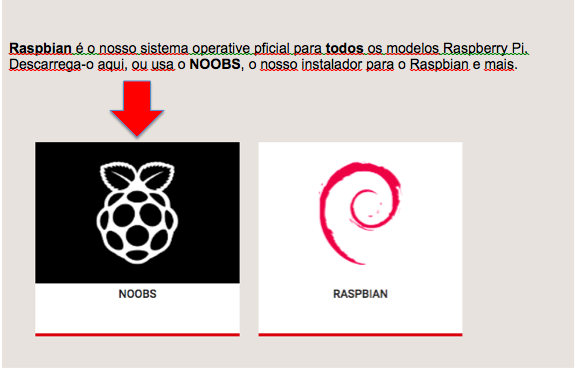

### Descarregar o NOOBS

A maneira mais fácil de instalar o Raspbian no teu cartão SD é usando o NOOBS. Para obter uma cópia do NOOBS:

+ Visite [www.raspberrypi.org/downloads/](https://www.raspberrypi.org/downloads/)

+ Você deve ver uma caixa com um link para os arquivos NOOBS. Clique no link.

+ A opção mais simples é descarregar o arquivo zip dos ficheiros.

### Formatar o cartão SD

Se o cartão SD no qual desejas instalar o Raspbian já tiver uma versão mais antiga do Raspbian, podes querer fazer o backup dos ficheiros do cartão primeiro, pois eles serão apagados durante este processo.

+ Visita o site da SD Association e descarrega o [SD Formatter 4.0](https://www.sdcard.org/downloads/formatter_4/index.html) para Windows ou Mac.

+ Siga as instruções para instalar o software.

+ Insira o cartão SD no leitor de cartão SD do computador de secretária ou computador portátil e anote a letra da unidade alocada, por exemplo, `F:/`.

+ No SD Formatter, selecione a letra da unidade do cartão SD e formate-a.

### Extrair o NOOBS do arquivo zip

Em seguida, é necessário extrair os ficheiros do arquivo zip com o NOOBS que você descarregou do site do Raspberry Pi.

+ Vai para a pasta *Downloads* e encontra o arquivo zip que descarregaste.

+ Extraie os ficheiros e mantem a aberta a janela Explorer / Finder resultante.

### Copiar os ficheiros

+ Agora abra outra janela do Explorer / Finder e navegue até o cartão SD. O melhor é posicionar as duas janelas lado a lado.

+ Seleciona todos os ficheiros da pasta *NOOBS* e arrasta-os para o cartão SD.

+ Ejeta o cartão SD.

### Arranque do NOOBS

+ Uma vez os arquivos copiados, insere o cartão micro SD no teu Raspberry Pi e liga o Pi a uma fonte de energia.

+ Ser-lhe-á oferecida uma escolha quando o instalador for carregado. Deves marcar a caixa **Raspbian** e, em seguida, clicar em **Instalar**.

+ Clique em **Sim** na caixa de diálogo de aviso e, em seguida, sente-se e relaxe. Vai demorar um pouco, mas o Raspbian irá ser instalado.

+ Quando o Raspbian tiver sido instalado, clique em **OK** e seu Raspberry Pi será reiniciado e o Raspbian será inicializado.

