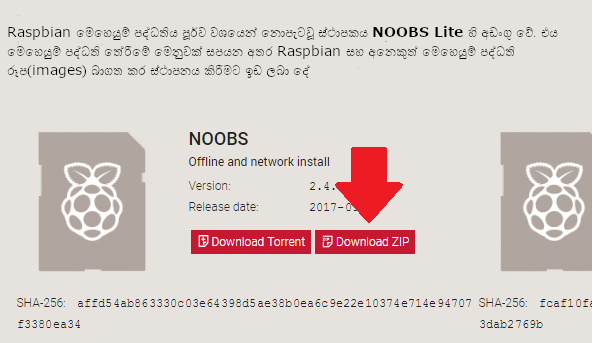

### NOOBS බාගත කිරීම

ඔබගේ SD කාඩ් පතේ Raspbian ස්ථාපනය(install) කිරීමට ඇති පහසුම ක්‍රමය NOOBS භාවිතා කිරීමයි. NOOBS හි පිටපතක්(copy එකක්) ලබා ගැනීම සඳහා:

+ [www.raspberrypi.org/downloads/](https://www.raspberrypi.org/downloads/) වෙත පිවිසෙන්න. 

+ NOOBS ලිපිගොනු(files) වෙත සබැඳියක්(link එකක්) ඇති කොටුවක් ඔබට දැකිය හැකිය. සබැඳිය(link එක) මත ක්ලික්(click) කරන්න.

+ සරලම ක්‍රමය වන්නේ, zip කල ලිපිගොනු(files) වල සංරක්ෂිතය(archive එක) බාගත(download) කිරීමයි.

### SD කාඩ්පත ආකෘතිකරණය(format) කිරීම

ඔබ විසින් Raspbian ස්ථාපනය(install) කිරීමට බලාපොරොත්තු වන SD කාඩ් පතේ දැනට පැරණි Rasbian අනුවාදයක්(version එකක්) තිබේ නම්, මෙම ක්‍රියාවලියේදී ලිපිගොනු(files) නැවත ලියනු(overwritten) ලබන බැවින්, කාඩ්පතේ ඇති ගොනු(files) පළමුව උපස්ථ(backup) කිරීම වඩා සුදුසු වේ.

+ SD Association's වෙබ් අඩවියට පිවිස [ SD ආකෘති කාරකය(Formatter) 4.0 ](https://www.sdcard.org/downloads/formatter_4/index.html) වින්ඩෝස්(Windows) හෝ මැක්(Mac) සඳහා බාගත කරගන්න.

+ මෘදුකාංගය(software) ස්ථාපනය(install) කිරීම සඳහා ලබදී ඇති උපදෙස්(instructions) අනුගමනය කරන්න.

+ ඔබේ SD කාඩ් පත පරිගණකයට හෝ ලැප්ටොප් පරිගණකයේ SD කාඩ් කියවනය තුළට ඇතුළු කර, ඒ සඳහා වෙන් කර ඇති ධාවක(drive) අකුර(letter එක) සටහන් කරගන්න, උදා. `F: /` .

+ SD ආකෘති කාරකයේ(Formatter එකේ), ඔබගේ SD කාඩ් පත සඳහා ධාවක(drive) අකුර(letter එක) තෝරා, එය සංයුති(format) කරනය කරන්න.

### zip සංරක්ෂිතයෙන්(archive එකෙන්) NOOBS උකහා(extracting) ගැනීම

ඊළඟට, ඔබට Raspberry Pi වෙබ් අඩවියෙන් බාගත(download) කළ NOOBS zip සංරක්ෂිතයෙන්(archive එකෙන්), ගොනු(files) උකහා(extract කර) ගැනීමට අවශ්‍ය වනු ඇත.

+ ඔබගේ *බාගැනීම්(Downloads)* ෆෝල්ඩරය(folder එක) වෙත ගොස් ඔබ බාගත කළ zip ගොනුව(file එක) සොයා ගන්න.

+ ලිපිගොනු(files) උකහාගැනීම(extract) සිදුකර, එහි ප්‍රතිඵලයක් ලෙස එන එක්ස්ප්ලෝරර් / සෙවුම්(Explorer/Finder) කවුළුව(window එක) විවෘතව තබාගන්න.

### ලිපිගොනු(files) පිටපත්(copy) කිරීම

+ දැන් තවත් එක්ස්ප්ලෝරර්/සෙවුම්(Explore/Finder) කවුළුවක්(window එකක්) විවෘත කර SD කාඩ් පත වෙත යන්න. කවුළු(window) දෙක එක ළග ස්ථානගත(side by side) කිරීම වඩාත් සුදුසුය.

+ *NOOBS* ෆෝල්ඩරයේ(folder එකේ) ඇති සියලුම ගොනු(files) තෝරාගෙන, ඒවා SD කාඩ්පතට ඇද දමන්න(drag කරන්න).

+ SD කාඩ් පත ඉවත්(eject) කරන්න.

### NOOBS මගින් ආරම්භ කිරීම(booting)

+ ලිපිගොනු(files) පිටපත්(copy) කළ පසු, micro SD කාඩ්පත ඔබේ Raspberry Pi එක තුළට ඇතුළු කර, Pi හි බල ප්‍රභවයට(power source එකට) සම්බන්ධ කරන්න.

+ ස්ථාපකය(installer එක) ආරම්භවීම(load වී) අවසන් වූවිට ඔබට තේරීමක්(choice එකක්) ලබා දෙනු ඇත. ඔබ **Raspbian** සඳහා වූ කොටුව සලකුණු කළ, පසුව **ස්ථාපනය(install)** ක්ලික් කරන්න.

+ අනතුරු ඇඟවීමේ පණිවිඩයට **ඔව්(Yes)** ක්ලික් කරන්න, පසුව වාඩි වී විවේකීව බලාසිටින්න. එයට ටික වේලාවක් ගතවනු ඇත, නමුත් Raspbian ස්ථාපනය(install) වනු ඇත.

+ Raspbian ස්ථාපනය(install) වී අවසන් වූ විට, **හරි(OK)**ක්ලික් කරන්න,එවිට ඔබේ Raspberry Pi එක නැවත ආරම්භ(restart) වන අතර Raspian ආරම්භ(boot) වේ.

