# Installing Raspbian using Windows 10

# Preparing the SD card

If you have a fresh SD card that has never been used, then you can probably skip this step, but it won't hurt to complete it if you are not sure.

Insert your SD card into your computer and wait for it to be recognised. The first thing to do is to make sure there are no existing partitions on the SD card. A partition is just a section of the card that can be used to store files.

1. Click on the *Windows* icon in the bottom left of the screen or tap the *Windows* key on your keyboard to open the *Start Menu*, and type the word **partition**:

  

2. Now click on the *Create and format hard disk partitions* program, which should be at the top of the menu.

3. The *Disk Management* program that opens can potentially delete all the files on your computer, so be careful. You should see a *disk* (here labelled disk1) that is approximately the same size as the SD card you inserted. Here an 8GB SD card has been used, and is showing as having 7.29GB of space:

  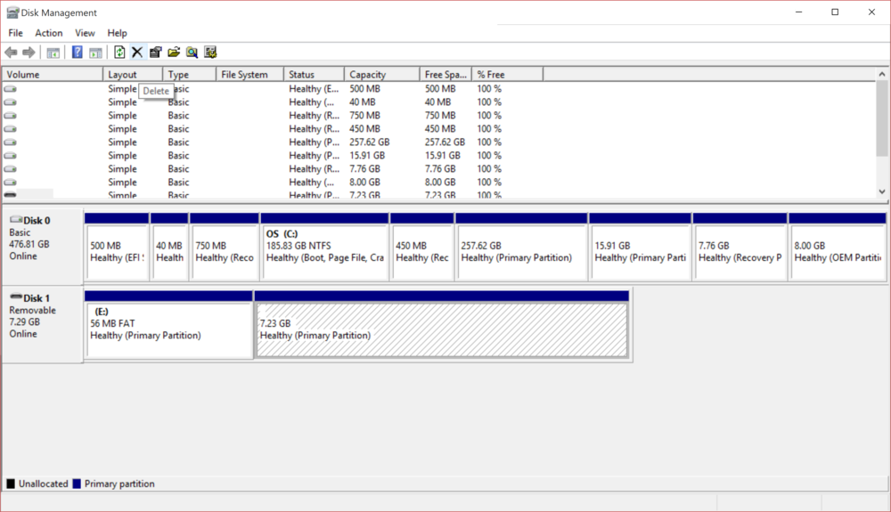

4. The SD card shown here has two partitions. Any partitions you see need to be deleted. This can be achieved by clicking on the partition and selecting the *delete* option from the menu bar (the black cross). Once all the partitions have been deleted, right-click on the *Unallocated* space and select *New Simple Volume* from the context menu:

  

5. A new window will open. All the default options can now be selected, but the guide below will take you through, step by step, in case you are unsure. First, click on *Next*:

  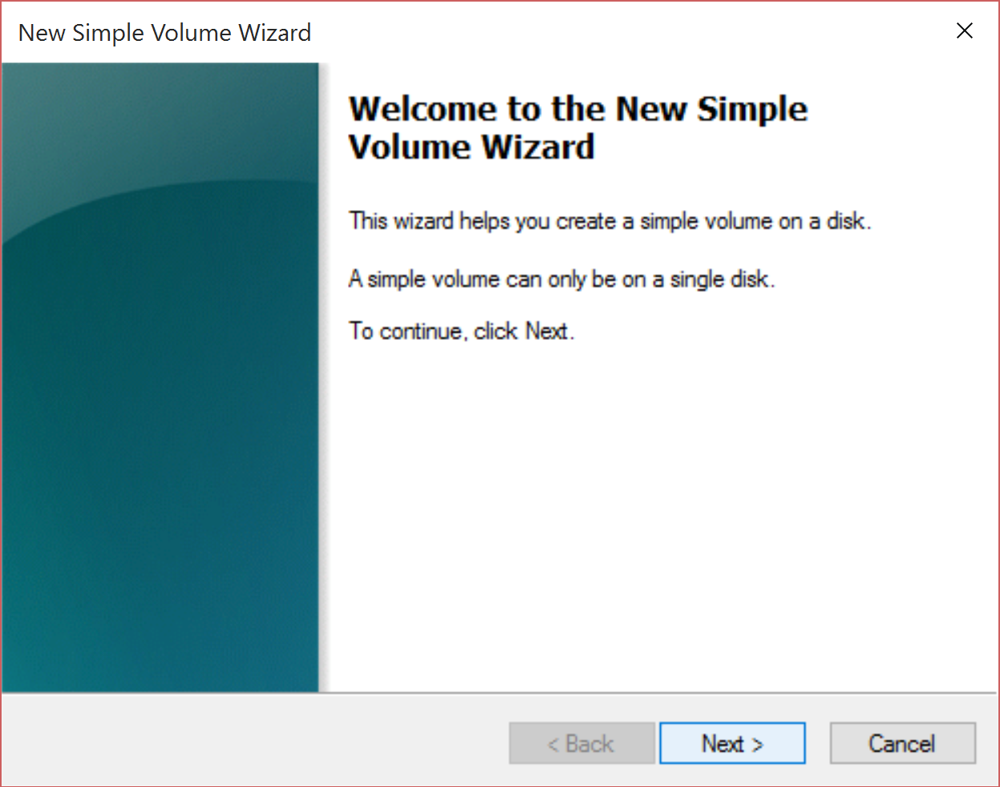

6. At the next screen, make sure the *Simple volume size in MB* is equal to the *Maximum disk space in MB* and click on *Next*:

  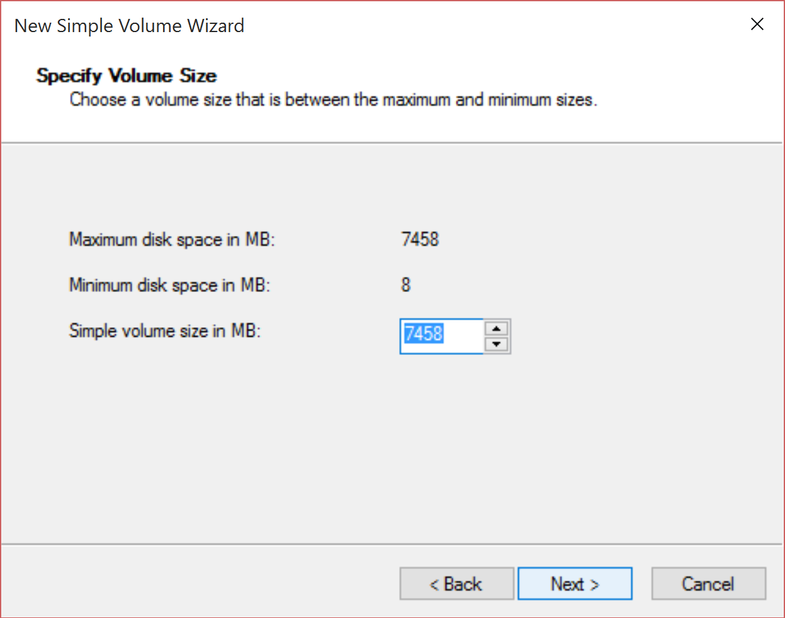

7. At the next stage it doesn't matter which *drive letter* is assigned, and will depend on the disk you have plugged into your computer. Just accept the default and click *Next*:

  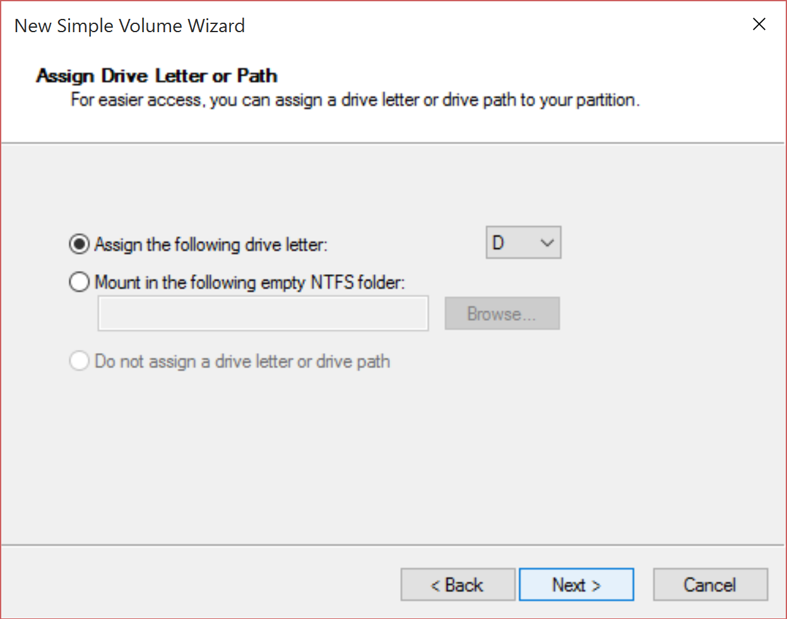

8. At the next screen, just accept the default *File system* and *Volume label* and click on *Next*:

  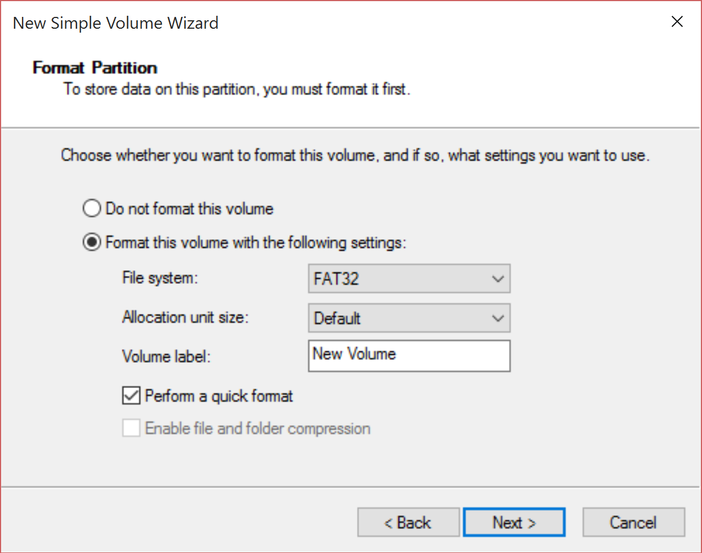

9. That's it! You have re-partitioned and formatted the SD card. Click on *Finish*:

  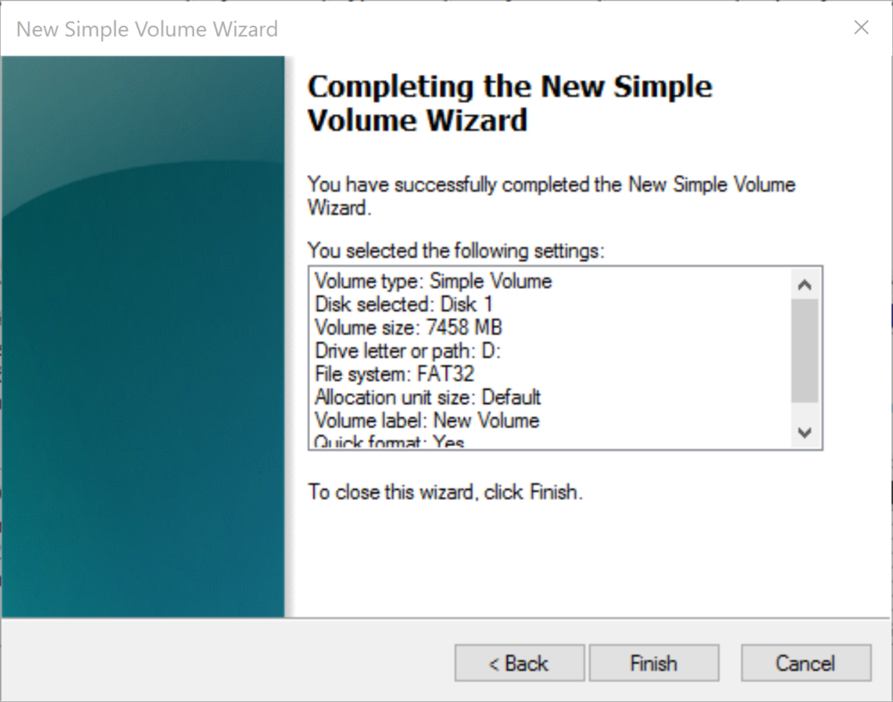

10. You should now see the formatted SD card in the *Disk Management* program with a single partition and a new label:

  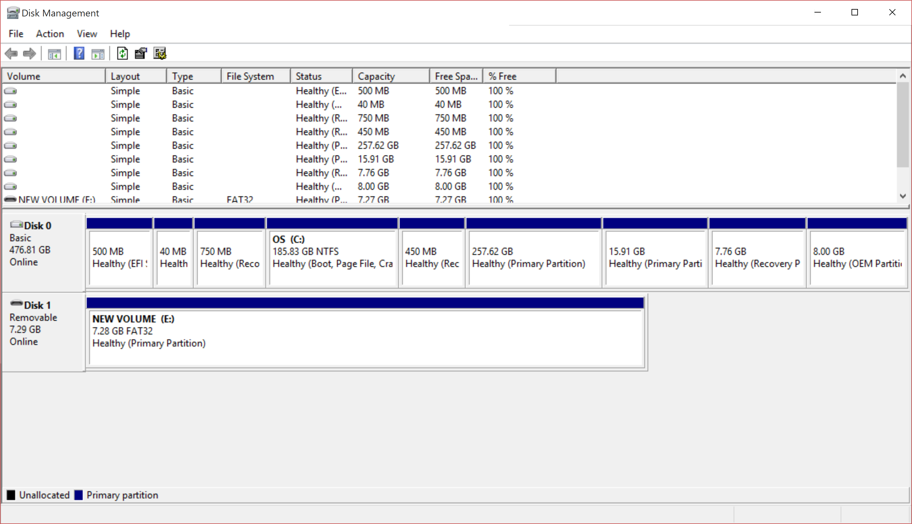

## Extracting NOOBS from the zip archive

Next, you will need to extract the files from the NOOBS zip archive you downloaded from the Raspberry Pi website.

1. Go to your *Downloads* folder and find the zip file.

2. Right-click on the the zip file and select *Extract All...* from the context menu:

  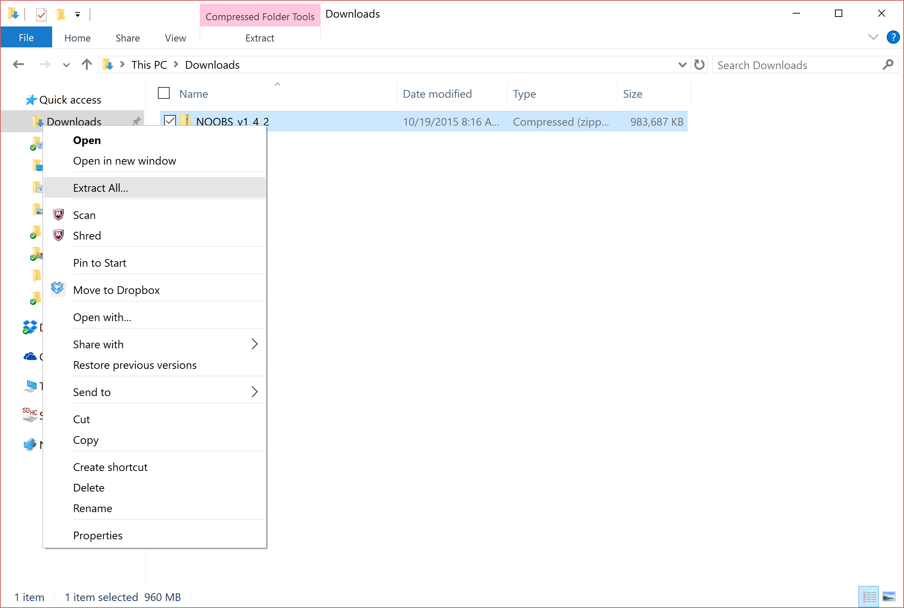

3. A new window will open, offering a choice of extraction locations; the default is fine, so click on the *Extract* button:

  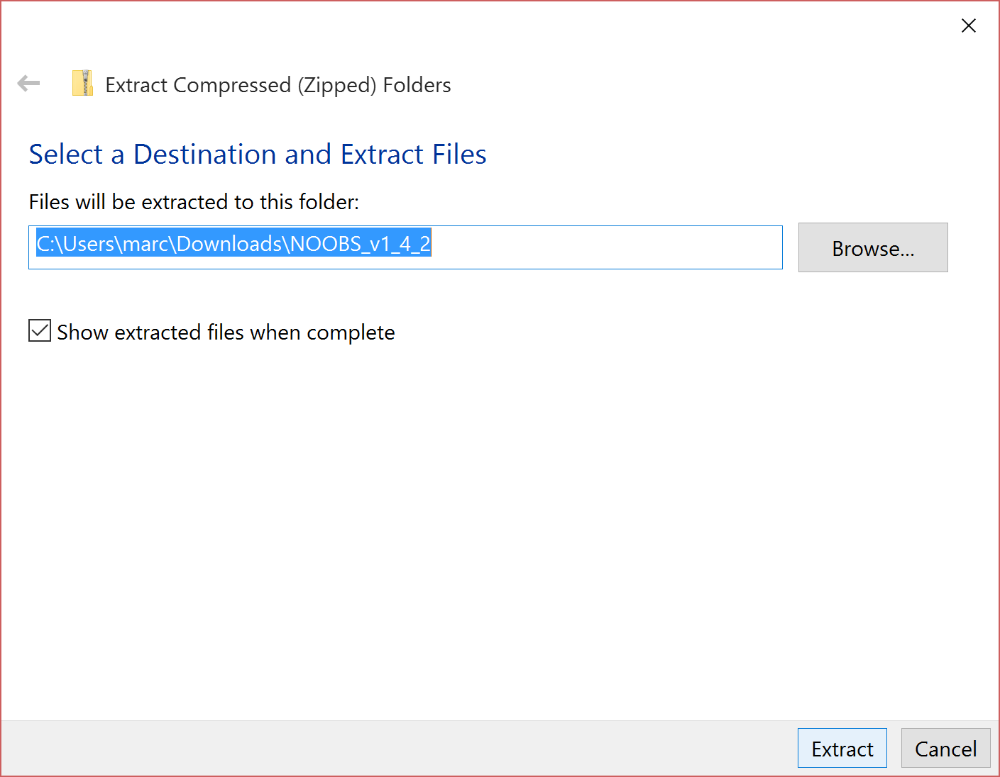

4. You should now see a new folder in your *Downloads* called *NOOBS*, with some version numbers after it. Open this folder to view the extracted files:

  

## Copying the files

5. Now open a new Explorer window and navigate to the SD card. It's best to position the two windows side by side:

  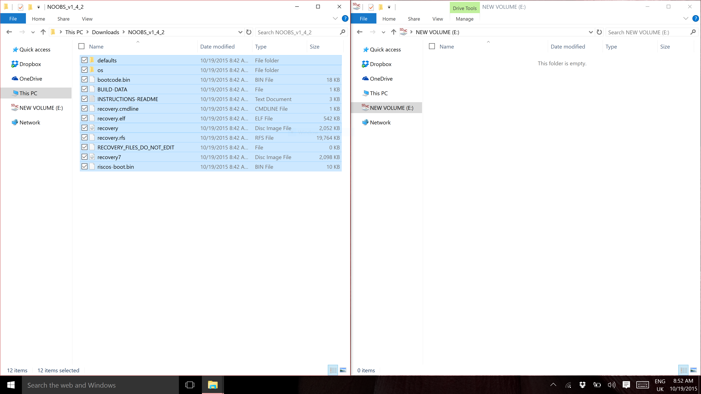

6. You can now select all the files from the *NOOBS* folder and drag them onto the SD card:

  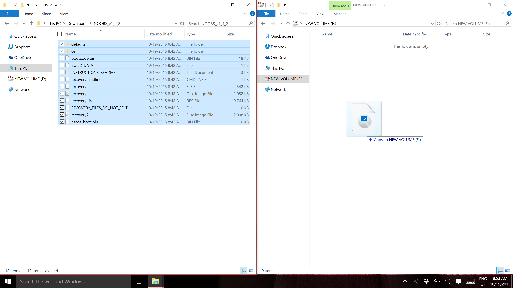

7. Eject the SD card, using the Safely Remove Hardware and Eject Media tool in the taskbar.

8. That's it: you're finished. Click on the link below the image to learn how to install Raspbian Jessie on your Raspberry Pi.

  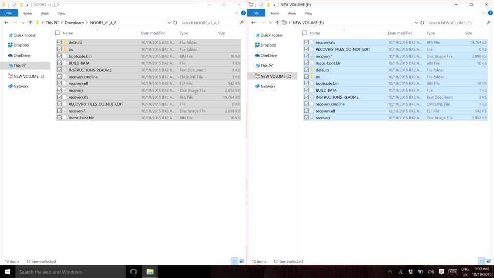

[Back to Getting Started with Raspbian](worksheet.md)
