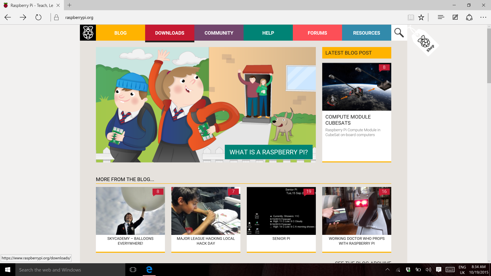
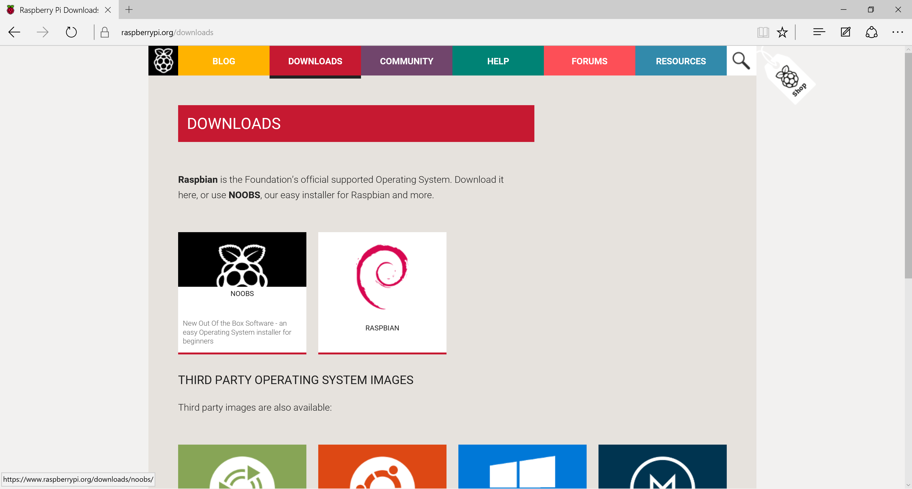
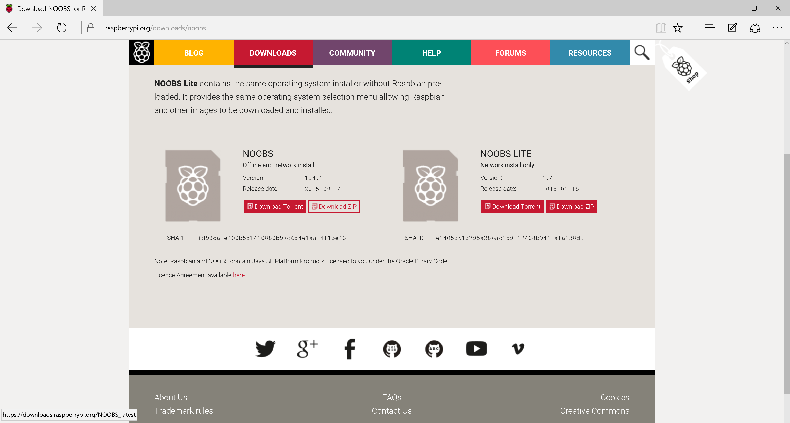

# Installing Raspbian using NOOBS

So you've just got hold of your first Raspberry Pi and you need to get it up and running, or maybe your old SD card just isn't cutting it anymore and you want a fresh install, or perhaps there's a new version of Raspbian that you're desperate to try out. This resource will show you how to get up and running with Raspbian on your Raspberry Pi in no time at all.

## Downloading NOOBS

Using NOOBS is the easiest way to install Raspbian on your SD card. To get hold of a copy of NOOBS:

1. Visit [www.raspberrypi.org](https://www.raspberrypi.org/) and click on the DOWNLOADS button in the navigation bar, at the top of the screen.

  

2. You should see a box which contains a link to the NOOBS files. Click on the link.

  

3. If you're familiar with torrenting, then you can download the NOOBS files via a torrent client, but otherwise the simplest option is to download the zip archive of the files.

  

## Writing NOOBS to an SD Card: Which OS?

If the SD card you wish to install Raspbian on currently has an older version of Raspbian, you may wish to back up the files from the card.

- I need to back up my card: [take me to the resource](backup.md)

To install Raspbian, you're going to need a computer. Depending on the operating system you are using, the setup instructions will be slightly different. To make things simple, this resource assumes that you are using either Microsoft Windows 10 or Apple OS X El Capitan. If you are using one of the many flavours of GNU/Linux, or if you are a technically proficient user of another OS, then you're probably more than capable of installing Raspbian yourself, but you might want to check out the guides [here](https://www.raspberrypi.org/documentation/installation/installing-images/).

If you are using an earlier version of one of the operating systems, then you should be able to follow the instructions, although some of the screenshots will look a little different.

- I'm running Windows 10: [take me to the resource](windows.md)

- I'm running OS X El Capitan: [take me to the resource](elcapitan.md)

## Booting from NOOBS

1. Once the files have been copied over, insert the micro SD Card into your Raspberry Pi and then plug it into a power source.

2. You will be provided with a single option, once the installer has loaded. You should check the box for **Raspbian**, and then click **Install**.

  

3. Click **Yes** at the warning dialog, and then sit back and relax. It will take a while, but Raspbian will install.

## What next?
- Now you have your Raspberry Pi up and running with Raspbian, why not learn how to program with our free [resources](https://www.raspberrypi.org/resources)
- Get physical with [Scratch](https://www.raspberrypi.org/learning/physical-computing-with-scratch/) or [Python](https://www.raspberrypi.org/learning/physical-computing-with-python/)
