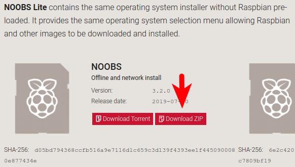
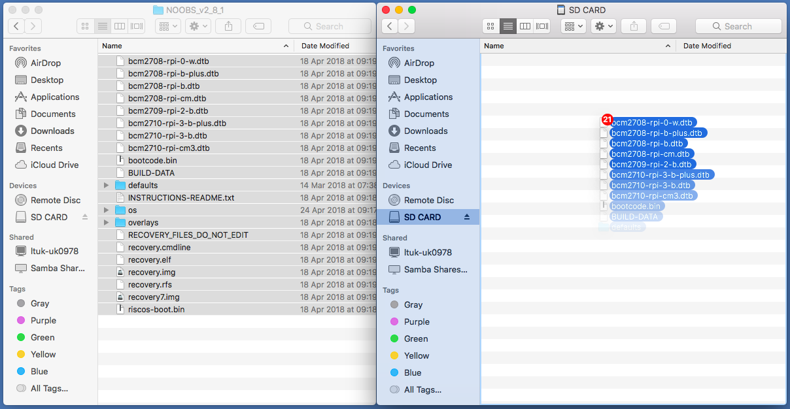

### 下载NOOBS

将Raspbian安装到SD卡上的最简单的方法是使用NOOBS。 通过下面的步骤下载NOOBS：

+ 访问 [www.raspberrypi.org/downloads/](https://www.raspberrypi.org/downloads/)

+ 您应该看到一个带有NOOBS文件链接的框。 点击该链接。

+ 最简单的选择是下载zip格式的文件。

### 格式化SD卡

如果您想要安装Raspbian的SD卡已经安装了旧版本的Raspbian，那么您可能需要先备份卡上的文件，因为格式化将覆盖原有文件。

+ 访问SD协会的网站并下载适用于Windows或Mac的 [SD Formatter 4.0](https://www.sdcard.org/downloads/formatter_4/index.html)。

+ 按照说明安装软件。

+ 将SD卡插入计算机或笔记本电脑的SD卡读卡器，并记下分配给它的驱动器号，例如 `F：/`。

+ 在SD Formatter中，选择SD卡的驱动器号并格式化。

### 从zip压缩文件中提取NOOBS

接下来，您将需要从您从Raspberry Pi网站下载的NOOBS zip存档中提取文件。

+ 转到您的 *下载* 文件夹并找到您下载的zip文件。

+ 提取文件并保持打开的结果浏览器/查找程序窗口。

### 复制文件

+ 现在打开另一个Explorer / Finder窗口并导航到SD卡。 最好将两个窗口并排放置。

+ 从 *NOOBS* 文件夹中选择所有文件并将它们拖到SD卡上。

+ 弹出SD卡。

### 从NOOBS启动

+ 一旦文件被复制完毕，将micro SD卡插入Raspberry Pi，然后将Pi插入电源。

+ 安装程序加载完成后，您将获得一个选择。 您应该勾选 **Raspbian**的框，然后单击 **Install**。

+ 在警告对话框中点击 **是** ，然后坐下放松。 这将需要一段时间，但Raspbian将安装。

+ 当安装Raspbian时，点击 **OK** ，你的Raspberry Pi将重新启动，然后Raspbian将启动。

