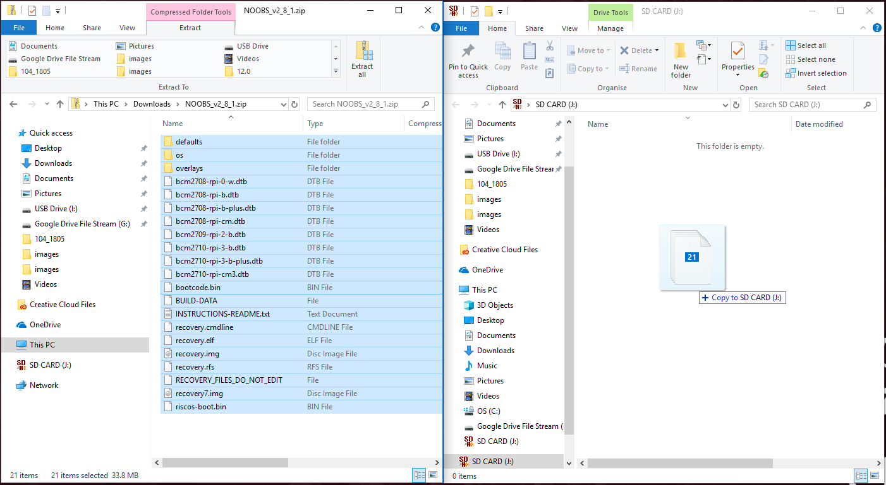

### 下載 NOOBS

在您的 SD卡上安裝 Raspbian 的最簡單方法是使用 NOOBS。 通過以下的步驟取得NOOBS：

+ 造訪 [www.raspberrypi.org/downloads/](https://www.raspberrypi.org/downloads/)

+ 您應該會看到一個有著 NOOBS 連結的方塊。 點擊該連結。

+ 最簡單的方法是下載該資料的zip檔。

### 格式化 SD卡

如果您想安裝 Raspbian 的 SD卡上已經安裝了較舊版本的 Raspbian，建議您先備份記憶卡上的資料，因為它們將在過程中被覆寫。

+ 造訪 SD協會的網站並下載適用於 Windows 或 Mac 的 [SD Formatter 4.0](https://www.sdcard.org/downloads/formatter_4/index.html)。

+ 按照說明安裝軟體。

+ 將 SD卡插入電腦或筆電的 SD卡讀卡機，並記下它的磁碟機代號，例如 `F: /`。

+ 在 SD Formatter 中，選擇 SD卡的磁碟機代號並格式化。

### 從zip壓縮檔中提取 NOOBS

接下來，您需要把從 Raspberry Pi 網站下載的 NOOBS zip檔解壓縮。

+ 前往您的 *下載* 資料夾並找出您下載的zip檔。

+ 解壓縮檔案，且不要把檔案管理視窗關閉。

### 複製資料

+ 現在打開另一個檔案管理視窗並切換到SD卡。 最好將兩個視窗並排。

+ 從 *NOOBS* 資料夾中選擇所有檔案並將它們拖到 SD卡上。

+ 退出 SD卡。

### 以 NOOBS 開機

+ 將檔案複製完成後，將 micro SD卡插入 Raspberry Pi，然後給 Pi 插上電源。

+ 安裝程式載入完成後，你將看見一些選項。 請勾選 **Raspbian** 的方框，然後點選 **Install**。

+ 在警告對話框中點選 **Yes** ，然後去放鬆一下。 Raspbian 安裝需要一段時間。

+ Raspbian安裝完成後，點擊 **OK** ，您的 Raspberry Pi 將重新開機，接著 Raspbian 將會啟動。

